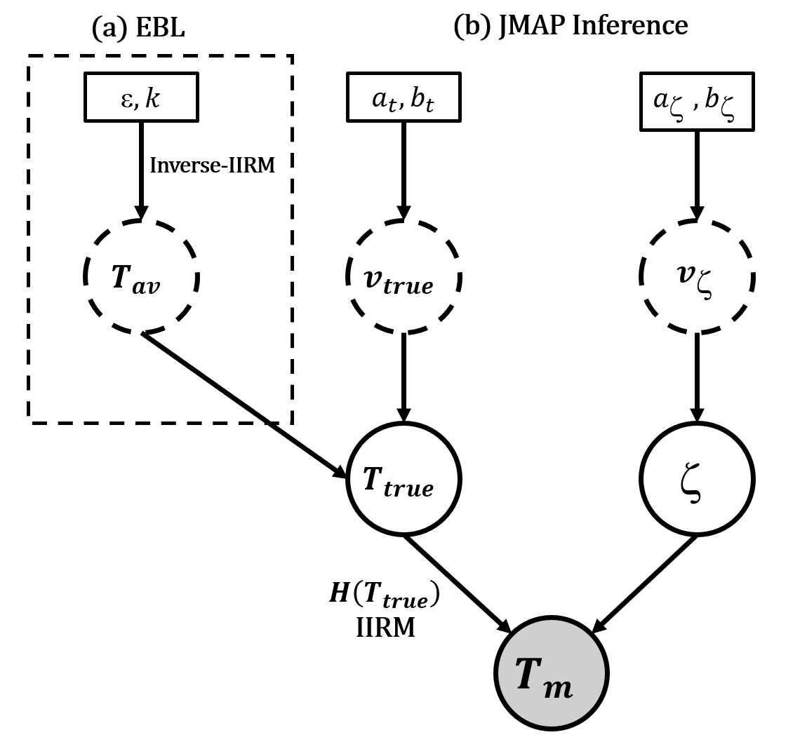
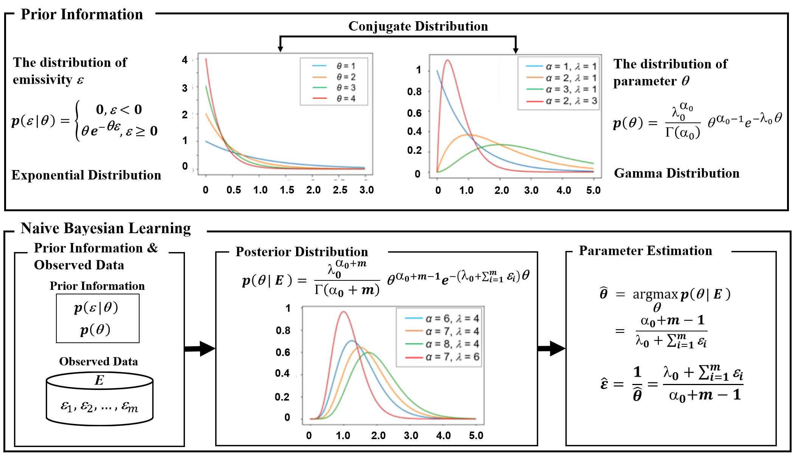
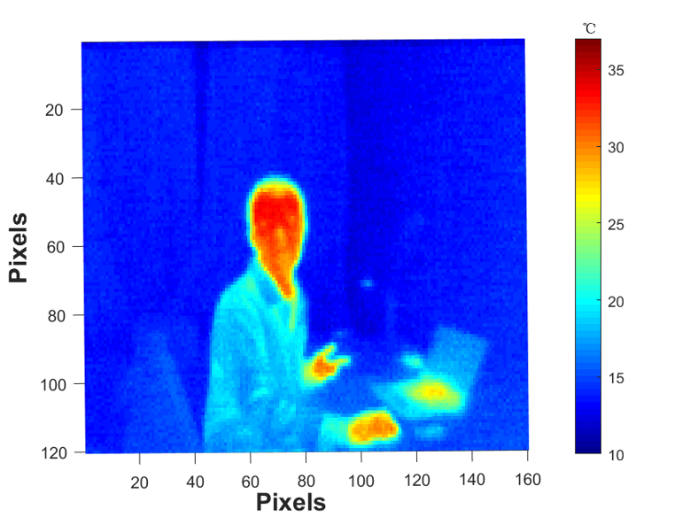
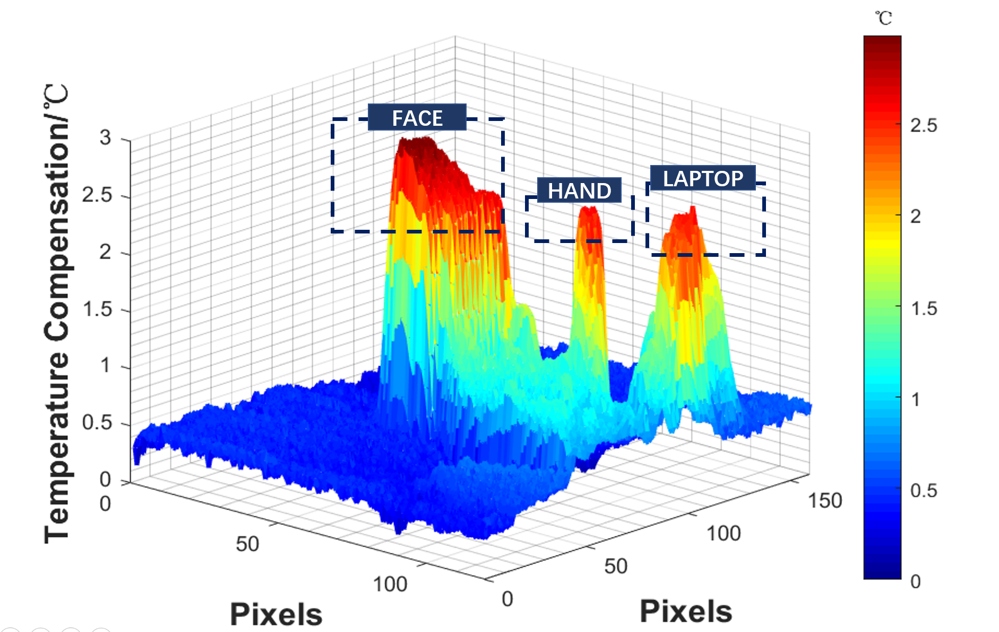

# Infrared-temperature-reconstruction-based-on-JMAP

# Notes:
Attenuation during infrared propagation causes the measured temperature always to be lower than the actual value.  A method of temperature reconstruction based on Bayesian inference is proposed. The JMAP method (JMAP) can improve the accuracy of temperature measurement with no need to improve the hardware performance of the measuring device. The improved infrared thermal radiation model is suitable for measuring scenarios  with different measuring distances, different humidity, and different emissivity. The proposed method has been validated to have small errors (≤ 0.1℃) through various experiments on a black body, human face.

[The paper and conference presentation of this project](https://www.spiedigitallibrary.org/conference-proceedings-of-spie/11559/2574940/High-precision-thermography-based-on-JMAP-inference-for-human-face/10.1117/12.2574940.short?SSO=1)

# Joint Maximum A Posterior (JMAP)
- The hierarchy model of the JMAP

- The distribution we used based on the prior information in the JMAP inference

# Some Results
- The raw infrared graph

- The infrared graph after reconstruction

- The improvement\difference between 2 graphs

